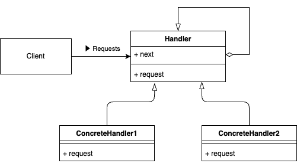

# Chain of Responsibility Pattern

## What is the "Chain of Responsibility Pattern"?

The Chain of Responsibility (CoR) Pattern is a behavioral design pattern that allows requests to be passed along a chain of handlers. Each handler in the chain decides either to process the request or to pass it on to the next handler. This approach decouples senders of a request from its receivers, giving multiple objects the opportunity to handle the request without requiring tight coupling between them.



## Why is the "Chain of Responsibility Pattern" needed?

1. **Decoupling of Request Senders and Receivers**
By passing the request through a chain of handlers, the objects sending the request do not need to know which specific handler ultimately processes it.

2. **Increased Flexibility**
You can add, remove, or reorder handlers in the chain without changing the request itself, making it easy to extend or modify request handling behavior.

3. **Consistent Processing Flow**
Each handler follows the same interface or inheritance structure, simplifying the process of understanding how requests move through the chain.

4. **Easier Maintenance**
Because each handler is focused on a particular aspect of request processing, responsibilities are neatly separated, and changes typically involve only a single handler.

## Sample Program

This sample demonstrates how different concrete handlers in the chain handle or pass on HTTP response objects based on the status code:

- **HttpResponseSupport**: The base class (struct) that defines the interface and behavior for setting the next handler and resolving the request (in this case, an HTTP response).

- **Concrete implementations of `HttpResponseSupport`**: Each type is responsible for a specific range of HTTP status codes. If the request falls in that range, it processes it; otherwise, it delegates to the next handler in the chain.
  - Entry(0 - 0): would not resolve HttpResponse, just "Entry" of this Chain.
  - InformationalResponseSupport(100 - 199)
  - SuccessfulResponseSupport(200 - 299)
  - RedirectionResponseSupport(300 - 399)
  - ClientErrorResponseSupport(400 - 499)
  - ServerErrorResponseSupport(500 - 599)
  
- **Client Code**: Creates a series of HttpResponse objects with various status codes, assembles the concrete handlers into a chain, and calls the Resolve method on the first handler. Each handler will either process the response or pass it on until the correct handler is found.

By organizing handlers in a chain, you can easily add, remove, or shift the responsibility of different HTTP status codes without changing the client code that sends these responses.

To run the sample code, execute 
```bash
go run ./cmd/CoR/main.go
```