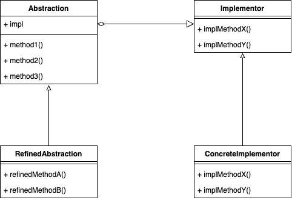
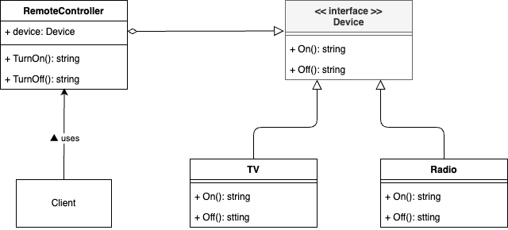

# Bridge Pattern

## What is "Bridge Pattern"?

The Bridge Pattern is a structural design pattern that separates an abstraction from its implementation, allowing both to vary independently. It’s useful when you want to avoid a permanent binding between an abstraction and its implementation.



## Why is "Bridge Pattern" needed?

1. **Decoupling Abstraction and Implementation**: It lets you split a large class or a set of closely related classes into two separate hierarchies—abstraction and implementation—which can be developed independently of each other.

2. **Increased Extensibility**: You can change or extend the implementation independently, without breaking the abstraction.

3. **Run-time Binding**: It allows the abstraction and implementation to be selected or switched at run time.

4. **Reduced Complexity**: The pattern simplifies code changes by moving code out of the core abstraction into dedicated classes.

## Sample program



This example demonstrates a remote controller that can operate different types of devices (like a TV or a radio) without changing the remote controller’s logic:

- **Device Interface**: Defines the operations that any device (TV, Radio, etc.) must implement (e.g., `On()`, `Off()`).
- **RemoteController**: Holds a reference to `Device`. Through this reference, it can perform operations on any device that implements the interface.
- **TV / Radio**: Concrete devices that provide specific implementations of `On()`, `Off()`, etc.

By using this pattern, you can seamlessly introduce new devices or change the implementation details of existing ones without modifying the `RemoteController` abstraction. To run the sample code, execute:

```bash
go run ./cmd/bridge/main.go
```