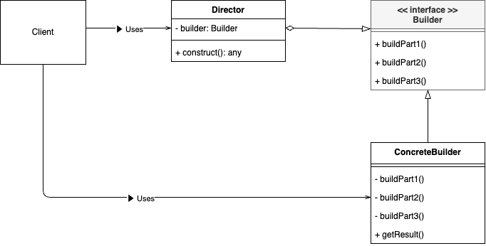
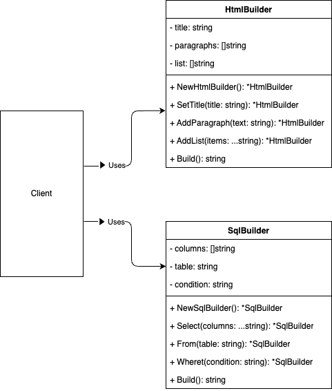

# Builder Pattern

## What is "Builder Pattern"?

The Builder Pattern is a creational design pattern that lets you construct complex objects step by step. It separates the construction of an object from its representation, allowing the same construction process to create different representations. By encapsulating the creation logic in a Builder, you gain flexibility and clarity when creating complex objects.



## Why is "Builder Pattern" needed?

1. **Complex Object Construction**: When you need to build objects that involve multiple steps or configurations, the Builder Pattern helps manage this complexity in a more organized way.

2. **Readable and Maintainable Code**: By hiding the construction details inside a builder, your client code remains clean and focused on specifying what to build, rather than how to build it.

3. **Reusability and Consistency**: Different builders can create different representations of the same construction process, sharing the same steps while producing different outcomes.

4. **Separation of Concerns**: The creation logic (builder) is separated from the object’s usage (the client). This reduces coupling and promotes cleaner code.

## Sample Program



This sample code demonstrates the Builder Pattern with two different use cases—constructing an HTML document and constructing an SQL query:

- **HtmlBuilder**: Builds an HTML document by specifying a title, paragraphs, and list items.  
- **SQLBuilder**: Builds an SQL query by specifying columns, a table name, and optional conditions.

By using this pattern, you can build these different representations through a similar step-by-step process, enabling flexibility and clarity in how objects are created.

To run the sample code, execute:

```bash
go run ./cmd/builder/main.go
```