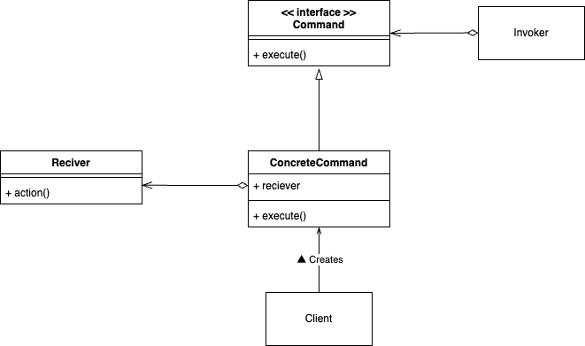
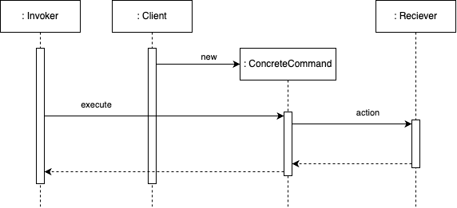
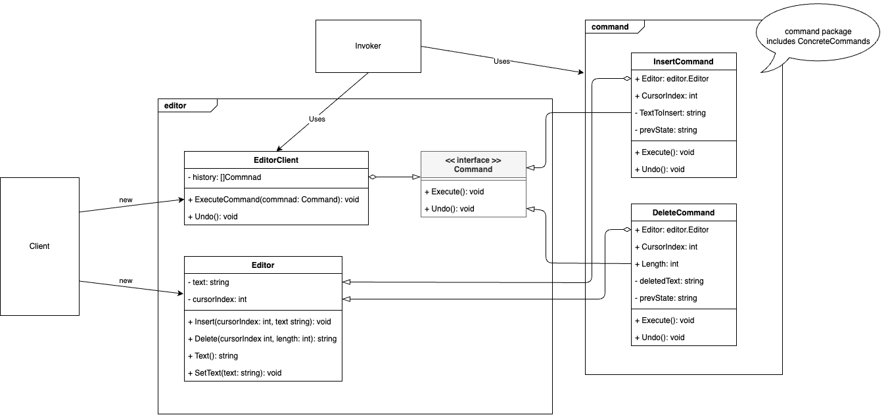

# Command Pattern

## What is "Command Pattern"?

The Command Pattern is a behavioral design pattern that encapsulates a request (or operation) as an object, decoupling the object that invokes the operation from the one that actually performs it. By turning their interactions into objects, you gain flexibility in manipulating and extending these requests (for example, by logging, queuing, or undoing them).





## Why is "Command Pattern" needed?

1. **Decoupling**: It separates the code issuing a request from the code that knows how to fulfill it. This results in more modular and maintainable code.

2. **Undo/Redo**: It supports undoable operations by storing state or commands in history so you can revert to a previous state.

3. **Extensibility**: Because requests are objects, new commands can easily be added without modifying existing code, promoting open-closed principle.

4. **Logging & Queuing**: Commands can be logged or queued, since they are objects that can be serialized or stored until needed.

## Sample Program



This sample code demonstrates the Command Pattern with a simple text editor where operations (insert and delete) can be undone:

- **InsertCommand**: Inserts text at the current cursor position in the editor.  
- **DeleteCommand**: Deletes text from the editor at the specified position and length.  
- **EditorClient**: Manages command execution history, allowing you to undo or redo operations as needed.

By using this pattern, you can easily add new commands (for example, copy, paste) and manage undo/redo functionality with minimal changes to the editor code.

To run the sample code, execute:
```bash
go run ./cmd/command/main.go
```