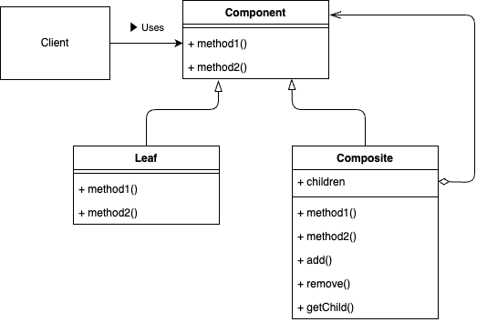
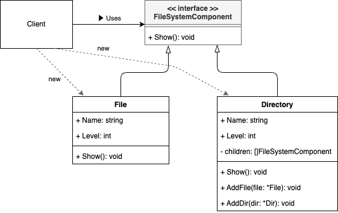

# Composite Pattern

## What is the "Composite Pattern"?

The Composite Pattern is a structural design pattern that lets you work with tree-like hierarchical structures. It treats individual objects (for example, Files) and containers of objects (for example, Directories) uniformly by having them implement the same interface (FileSystemComponent). This allows you to handle both single elements and entire containers recursively, providing a natural way to represent hierarchical structures.



## Why is the "Composite Pattern" needed?

1. **Representation of Recursive Structures**
When you have objects or data organized into nested containers (like directories containing files, which in turn may contain more files and directories), the Composite Pattern helps you model such recursion in an intuitive manner.

2. **Increased Flexibility**
You can add new leaf or container components without dramatically changing existing code. Both leaf elements (Files) and containers (Directories) fit into the same interface.

3. **Consistent Operations**
By using a single interface for both leaf and container, clients can perform the same operations on a File or a Directory, simplifying the overall design and reducing code duplication.

4. **Easier Maintenance**
Since each element follows the same interface, adding new behaviors or new types of components (such as new leaf types) does not require restructuring the entire codebase.

## Sample Program



This sample demonstrates how to represent a file system using the Composite Pattern, where both files and directories implement the FileSystemComponent interface.

With this setup, directories can contain additional directories or files, and client code can treat all components in a unified manner without needing to manually distinguish between files and directories.

- **FileSystemComponent**: The interface implemented by both Files and Directories.
- **File**: A leaf node representing an actual file.
- **Directory**: A composite node that can hold files and directories.

This approach ensures you can easily add new element types by simply implementing the same interface, keeping the overall design flexible and cohesive.

To run the sample code, execute 
```bash
go run ./cmd/composite/main.go
```
