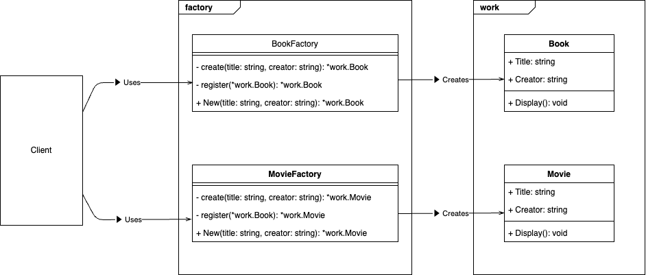

# Factory Pattern

## What is "Factory Pattern" ?

The Factory Pattern is a creational design pattern that provides a way to create objects without exposing the creation logic. Instead, it delegates the object creation process to specific factory methods. This pattern is particularly helpful when there is a need to manage or manipulate various subclasses under a shared interface, and you’d prefer to encapsulate the creation details in a single place.


## Why is "Factory Pattern" needed ?

1. **Simplifies Object Creation**: Instead of placing object creation logic throughout your code, factories centralize the creation process and make it easier to handle changes and expansions.

2. **Encourages Loose Coupling**: By depending only on the interface or abstract class, clients remain agnostic to the concrete types being created, promoting flexibility and reducing code dependencies.

3. **Improves Code Maintainability**: Changes to object creation can be made in the factory without affecting the rest of the system, making your codebase easier to maintain and extend.

4. **Extensibility**: You can easily add new product types (subclasses) by creating new concrete factories, eliminating the need to modify existing client code.

## Sample program



This sample code demonstrates how the Factory Pattern can be used to create different types of works (books and movies) through specialized factory methods. Each concrete creator (e.g., BookCreator, MovieCreator) is responsible for producing a specific product type, while the client code only needs to know about the factory interface.

- **BookCreator**: A factory that creates Book objects.
- **MovieCreator**: A factory that creates Movie objects.
- **Book**: A product type representing a written work.
- **Movie**: A product type representing a film.

By using this pattern, you can hide the logic required to instantiate or register specific object types behind the factory interface, making it straightforward to add new product types or modify existing ones without altering the client code.

To run the sample code, execute
```
go run ./cmd/factory/main.go
```