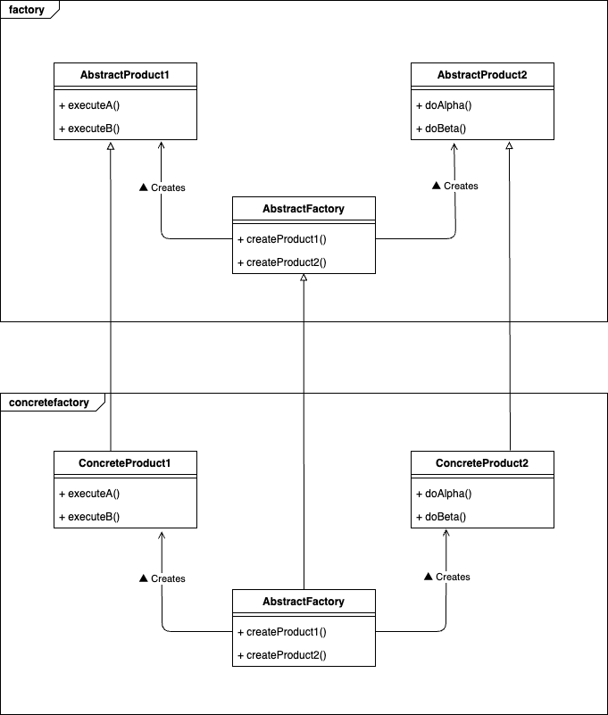

# Abstract Factory Pattern

## What is "Abstract Factory Pattern"?

The Abstract Factory Pattern is a creational design pattern that provides an interface for creating families of related objects without specifying their concrete classes. It allows you to create different objects that share a common theme or purpose, ensuring that all objects produced by a particular factory are compatible with each other.



## Why is "Abstract Factory Pattern" needed?

1. **Encapsulation of Object Creation**: It centralizes the creation logic, so you don’t have to worry about instantiating the correct objects throughout the codebase.

2. **Easy to Switch Families of Products**: By changing the factory you use, you can easily switch between different families of products (such as Stripe or PayPal in this example) without changing existing client code.

3. **Consistency**: Ensures that the objects created by one factory are designed to work together, avoiding potential issues with incompatible products.

4. **Scalability**: You can add new factories or products without modifying the core logic, making it easier to extend the system.

## Sample program

In this sample code, I demonstrate how the Abstract Factory Pattern can be used to create different payment processors (Stripe, PayPal, etc.) through a unified interface.

**Note**: Go implicitly satisfies interface requirements. In this program, I do not directly refer to the interface’s API, so the interface definition has been omitted for simplicity.

- **StripeFactory**: Creates Stripe-specific payment processors (e.g., credit card and bank transfer).  
- **PayPalFactory**: Creates PayPal-specific payment processors (e.g., credit card and bank transfer).  
- **ProcessPayment**: Each processor provides a method to process payment for a given amount.

By using this pattern, you can easily switch between different payment providers (Stripe, PayPal, etc.) or extend the system with new providers without changing the client code.

To run the sample code, execute:

```bash
go run ./cmd/abs_factory/main.go
```
