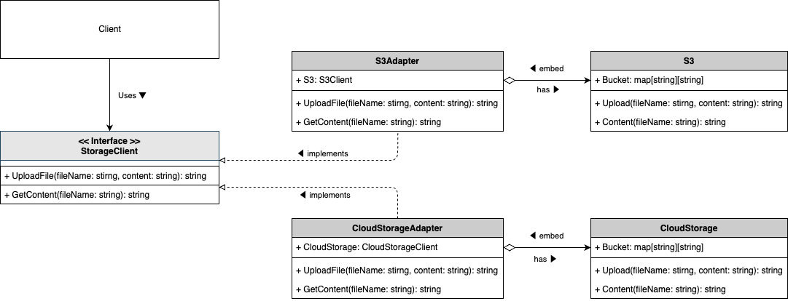

# Adapter Pattern

## What is "Adapter Pattern" ?

The Adapter Pattern is a structural design pattern that allows objects with incompatible interfaces to work together. It acts as a bridge between two incompatible interfaces by wrapping an existing class with a new interface.

## Why is "Adapter Pattern" needed ?

The Adapter Pattern is useful in the following scenarios:

1. **Compatibility**: It allows classes with incompatible interfaces to communicate, enabling integration of new components into existing systems without modifying the existing code.

2. **Reusability**: By using adapters, you can reuse existing classes even if they don't have the desired interface, promoting code reuse and reducing duplication.

3. **Flexibility**: The pattern provides a flexible way to connect different interfaces, making it easier to extend and maintain the system.

4. **Separation of Concerns**: It separates the interface conversion logic from the business logic, leading to cleaner and more maintainable code.

## Sample program

This sample code demonstrates the use of the Adapter Pattern with an example of cloud storage services. The program allows uploading and retrieving files using different cloud storage services (AWS S3 and GCP Cloud Storage) through a unified interface.

- **StorageClient**: An interface representing a storage client with methods to upload files and retrieve content.
- **S3Adapter**: An adapter for AWS S3, implementing the StorageClient interface to allow interaction with AWS S3.
- **CloudStorageAdapter**: An adapter for GCP Cloud Storage, implementing the StorageClient interface to allow interaction with GCP Cloud Storage.
- **S3**: A struct representing AWS S3, with methods to upload files and retrieve content.
- **CloudStorage**: A struct representing GCP Cloud Storage, with methods to upload files and retrieve content.

By using this pattern, you can interact with different cloud storage services through a common interface, making it easy to switch between services or add new ones without changing the client code.

To run the sample code, execute `go run ./cmd/adapter/main.go`.