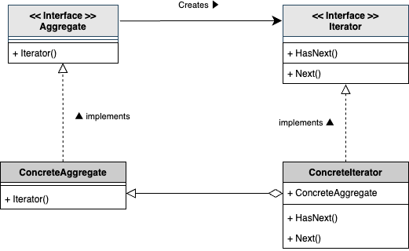

# Iterator Pattern

## What is "Iterator Pattern" ?

The Iterator Pattern is a design pattern that provides a way to access the elements of an aggregate object sequentially without exposing its underlying representation. It is commonly used to traverse collections like lists, arrays, or other data structures.

## Why is "Iterator Pattern" needed ?

While `for` loops provide a straightforward way to iterate over collections, the Iterator Pattern offers several advantages:

1. **Encapsulation**: The Iterator Pattern encapsulates the iteration logic, allowing the collection's internal structure to remain hidden. This means you can change the underlying data structure without affecting the code that uses the iterator.

2. **Multiple Iterations**: It allows multiple iterators to traverse the same collection independently, which can be useful in scenarios where you need to maintain multiple traversal states.

3. **Uniform Interface**: The pattern provides a uniform interface for traversing different types of collections, making it easier to work with various data structures in a consistent manner.

4. **Flexibility**: Iterators can be extended to provide additional functionality, such as filtering or transforming elements during iteration.

5. **Separation of Concerns**: By separating the iteration logic from the collection itself, the Iterator Pattern promotes cleaner and more maintainable code.

## Sample program

This sample code demonstrates the use of the Iterator Pattern with an example of fruits and a fruit basket. The fruit basket is treated as a collection containing multiple fruits, and an Iterator is used to access the fruits sequentially.

- **Fruit**: A struct representing a fruit, with properties such as name and type.
- **FruitBasket**: A struct representing a collection of fruits, providing methods to add fruits and obtain an Iterator.
- **basketIterator**: An Iterator struct for accessing the fruits in the FruitBasket sequentially. This struct includes methods to check if there are more fruits and to retrieve the next fruit.

By using this pattern, you can process the fruits in the basket sequentially while keeping the internal structure of the fruit basket hidden.

To run the sample code, execute `go run ./cmd/iterator/main.go`.
