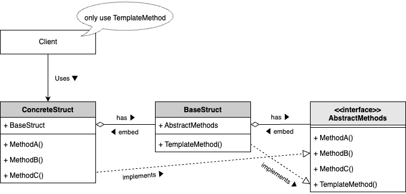
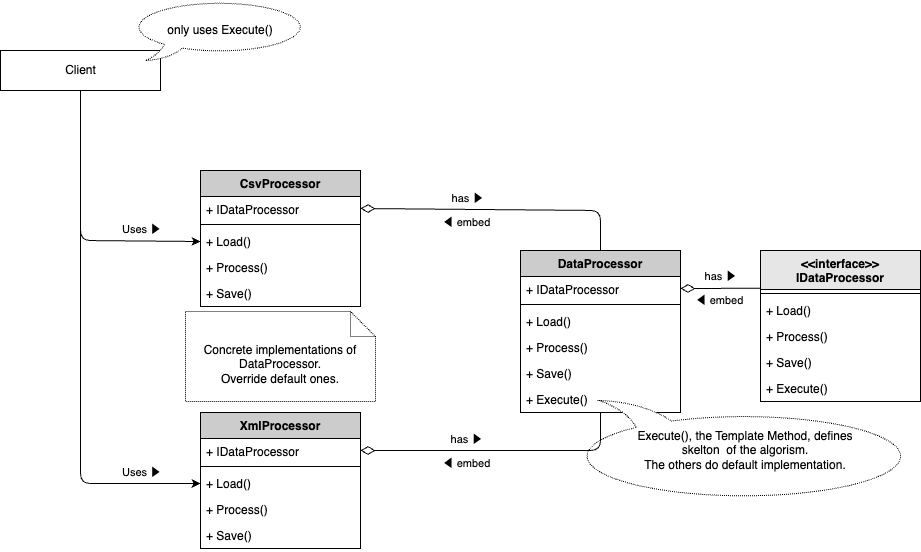

# Template Pattern

## What is "Template Pattern"?

The Template Pattern is a behavioral design pattern that defines the skeleton of an algorithm in a function, deferring some steps to other functions. It allows other functions to redefine certain steps of an algorithm without changing its structure. This pattern is commonly used to implement the invariant parts of an algorithm once and allow other functions to implement the behavior that can vary.

## Why is "Template Pattern" needed?

The Template Pattern offers several advantages:

1. **Code Reusability**: By defining the algorithm's structure in a base function, you can reuse the code across different implementations, reducing duplication.

2. **Flexibility**: Functions can override specific steps of the algorithm, allowing for flexibility and customization without altering the algorithm's overall structure.

3. **Consistency**: The pattern ensures that the algorithm's structure remains consistent across different implementations, promoting uniformity.

4. **Separation of Concerns**: By separating the invariant parts of the algorithm from the variant parts, the Template Pattern promotes cleaner and more maintainable code.

## Sample program

This sample code demonstrates the use of the Template Pattern with an example of a CSV data processing system. The system processes CSV data using a common algorithm structure defined in a base processor function.

- **IDataProcessor**: An interface defining the template method and steps for data processing.
- **BaseProcessor**: A struct providing a default implementation of the `Execute` function, which defines the skeleton of the algorithm.
- **CsvProcessor**: A concrete implementation of `IDataProcessor` that provides specific implementations for loading, processing, and saving CSV data.

By using this pattern, you can process CSV data using a consistent algorithm structure while allowing for specific customizations in the `CsvProcessor`.

To run the sample code, execute `go run ./cmd/template/main.go`.